# Práctica ETL – Ferretería El Tornillo Feliz

## Descripción del Problema
La Ferretería El Tornillo Feliz presenta una problemática común en sistemas distribuidos: la falta de estandarización en los datos recolectados desde diferentes sucursales.

Los principales problemas identificados son:

- **Inconsistencia en categorías:**  
  Ejemplo: "Htas", "herram.", "HERRAMIENTAS", "Herramienta"

- **Formato incorrecto en precios:**  
  Valores almacenados como texto con símbolos (`$8.50`)

- **Unidades de medida heterogéneas:**  
  Ejemplo: "1 und", "1 unidad", "1u", "1L", "1 Lt"

Estas inconsistencias afectan directamente la calidad del análisis, la generación de reportes y la toma de decisiones por lo cual nosotros mediante la herramienta de Pentaho limpiaremos esta base de datos.

## Desarrollo
## Modelo de Datos
1. Creamos la base datos original sin ningún tipo de procedimiento, aquí se almacenaran los datos puros.

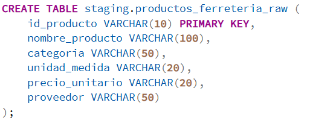

2. Insertamos los registros de todas las sucursales de la ferreteria "El Tornillo Feliz".

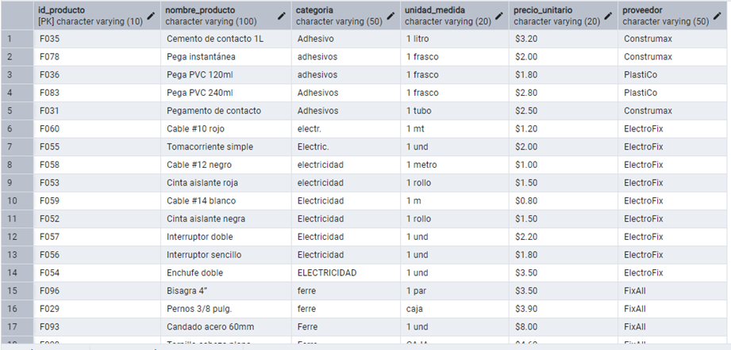

## Proceso ETL
Para el proceso de limpieza se utilizo Pentaho Data Integration, en donde se siguió una secuencia lógica de limpieza y estandarización.

# 1. Extracción (Extract)
Para este primer paso, sobre un Table Input se establecio una conexión con la base de datos PostgreSQL y se ejecuto una consulta para extraer los datos desde la tabla.

`SELECT * FROM staging.productos_ferreteria_raw;`

Esto con el objetivo de obtener los datos en su estado original para poder ser procesados, cabe aclarar que en esta etapa no se realizó ninguna transformación.

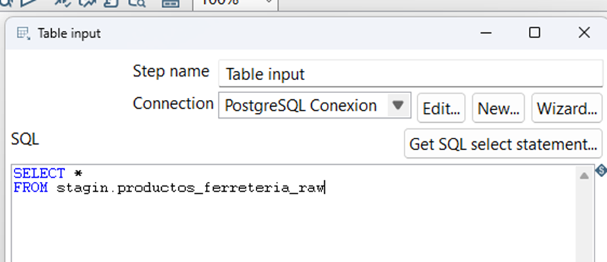

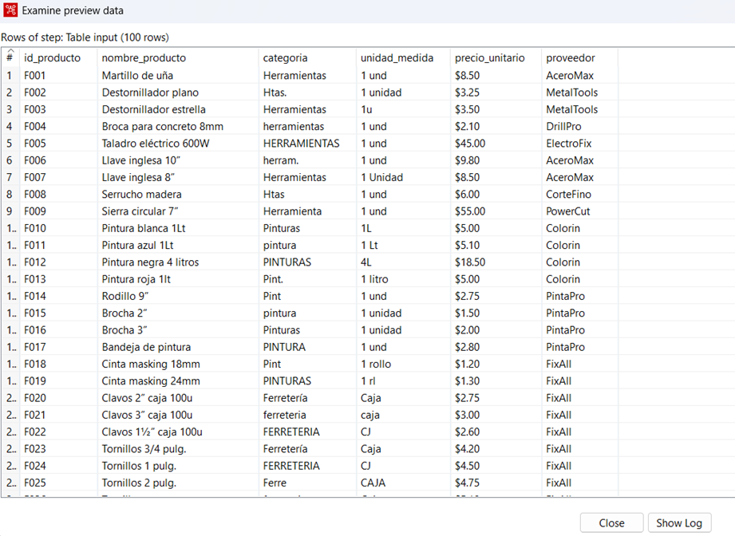

# 2. Transformación (Transform)
Esta es la fase más importante del proceso ETL, donde se corrigen las inconsistencias.

## Paso 1: String Operations 
Esta transformación nos permite aplicar operaciones sobre cadenas de texto. Donde las transformaciones aplicadas fueron:
- Eliminación de espacion en blanco (Trim)
- Normalización de texto (evitar diferencias por espacios o caracteres invisibles)

Los campos procesados fueron:
- `categoria`
- `unidad_medida`
- `nombre_producto`

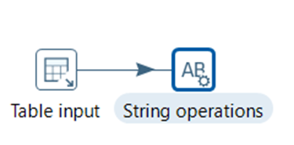

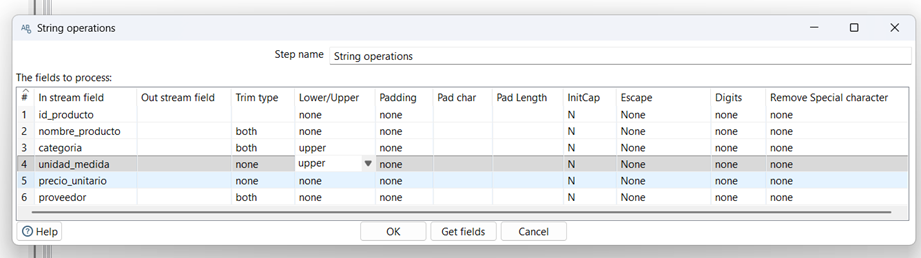

## Paso 2: Replace in String
Reemplazamos y eliminamos caracteres dentro de los campos, uno de ellos fue eliminar el simbolo `$` del campo `precio_unitario`.

| Antes | Después |
| ----- | ------- |
| $8.50 | 8.50    |

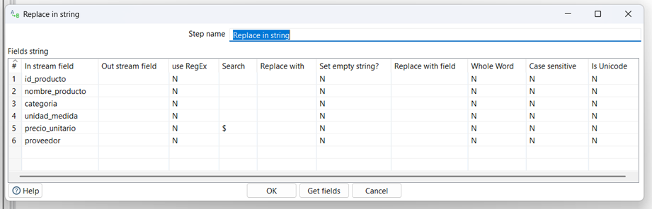

## Paso 3: Select Values
En este proceso seleccionamos, renombramos y cambiamos el tipo de los campos.

- Convertimos el campo `precio_unitario` de texto a tipo numérico.

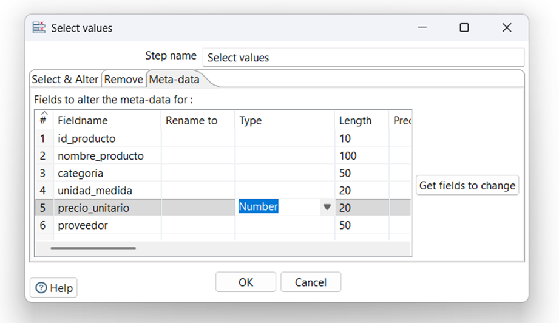

## Paso 4: Value Mapper - Categorías
Con esta proceso mapeamos los valores inconsistentes a un valor estándar, es decir, se unificaron diferentes variantes en una sola categoría.

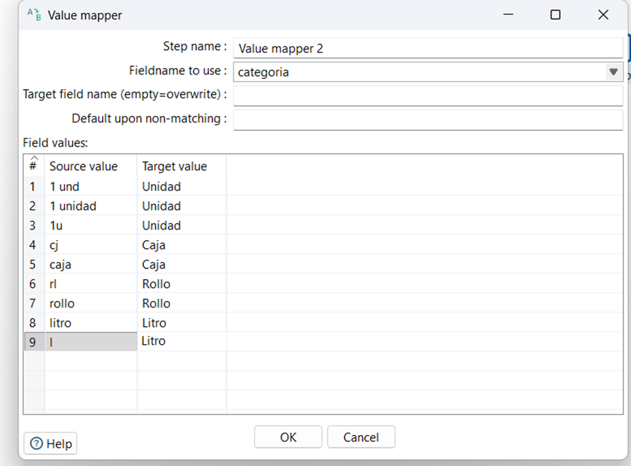

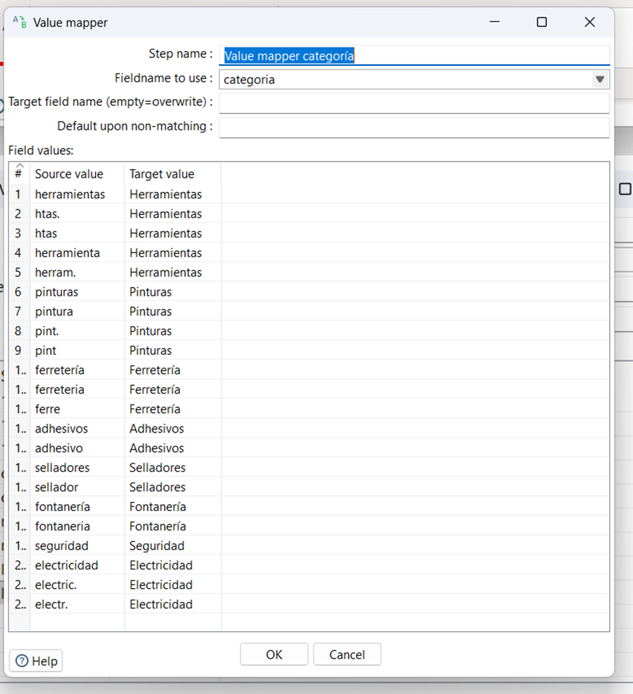

## Paso 5: Value Mapper - Unidades de Medida
Estandarizamos las unidades para evitar duplicidad semántica.

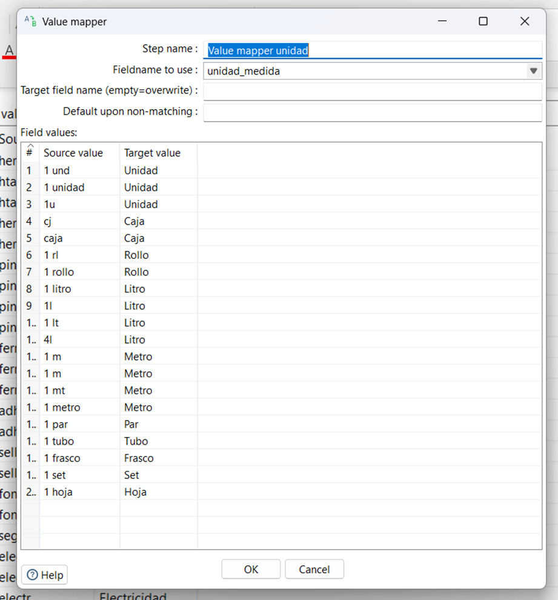

# 3. Carga (Load)
Finalmente se cargan los datos en la tabla destino:

`staging.productos_ferreteria_clean`

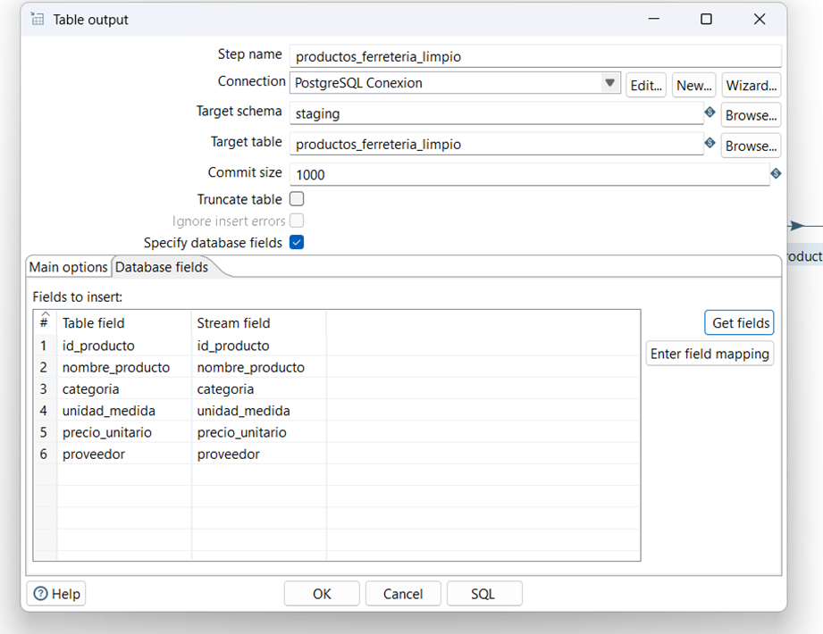

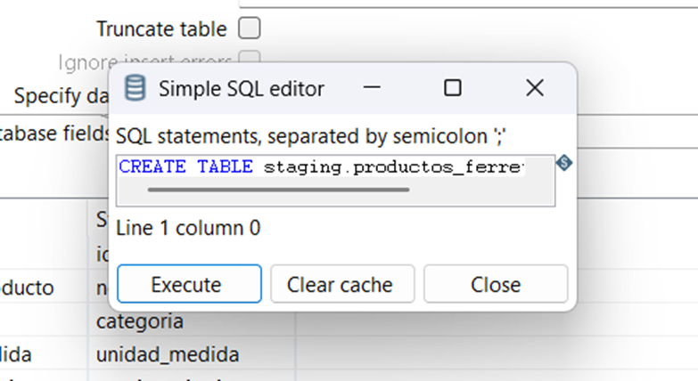

# 4. Flujo del ETL
El flujo implementado sigue la siguiente secuencia:

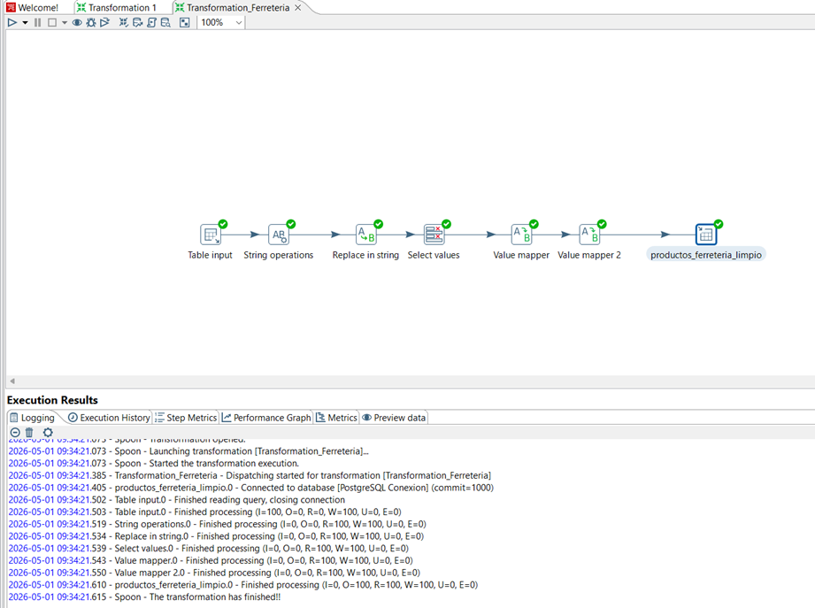

# 5. Resultado
Mediante el proceso ETL se logro:
- Normalizar completamente los datos
- Eliminar caracteres innecesarios
- Estandarizar categorías y unidades
- Convertir precios a formato numérico

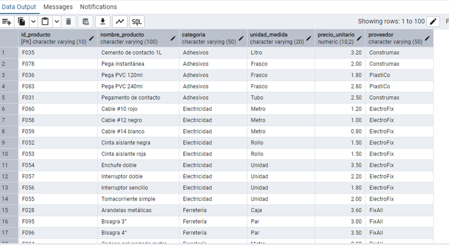

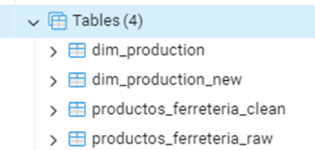
